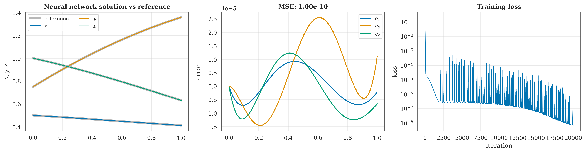
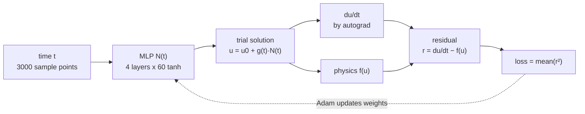
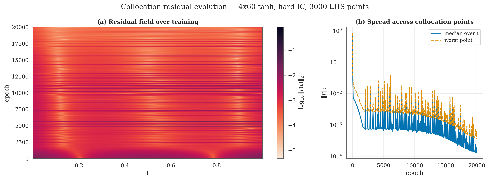
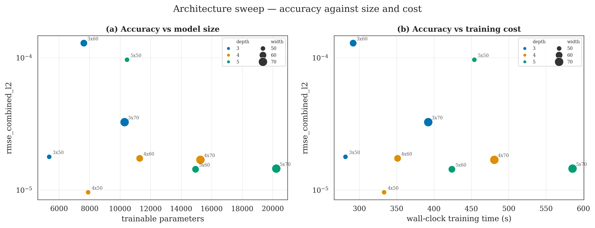

<div align="center">

# Lorenz-1960 PINN

**A neural network that solves a 1960 weather model from the equations alone, without ever being shown the answer.**

[](https://www.python.org/)
[](https://pytorch.org/)
[](src/pinn/test_pinn.py)



</div>

Edward Lorenz's 1960 paper strips atmospheric flow down to three numbers that push
each other around. There is no formula for the answer, so people integrate it step
by step with a numerical solver. This project does it a different way: a network of
11,283 weights is told only the rules of motion, never the answer, and learns the
solution by making itself satisfy the equations.

It ends up within `3e-05` of a high-accuracy reference solver at every point of the
window, which is about five correct decimal places. Training takes under six
minutes on a laptop CPU. No dataset is involved at any stage.

## Contents

- [How the claims are checked](#how-the-claims-are-checked)
- [How it works](#how-it-works)
- [Getting started](#getting-started)
- [The five commands](#the-five-commands)
- [What a run writes](#what-a-run-writes)
- [Results](#results)
- [Architecture sweep](#architecture-sweep)
- [Figures](#figures)
- [Configuration](#configuration)
- [Repository layout](#repository-layout)
- [Limits of these results](#limits-of-these-results)
- [Further reading](#further-reading)

## How the claims are checked

Research code tends to be a notebook that produced a number once. This repository
is set up so that every number in it can be re-derived, and so that the things that
would quietly invalidate the result are tested rather than assumed.

- **The answer key is provably kept out of training.** The loss is the ODE residual
  and nothing else ([`pinn.py`](src/pinn/pinn.py)). The reference solver is called
  only after training. Columns derived from it are labelled *evaluation only*
  everywhere they appear.
- **The loss can be taken apart by hand.** Every collocation point's contribution
  is written to CSV before the optimiser step. Add the column up and you get the
  loss the trainer reported, to eight significant figures. `python run_epoch.py`
  prints both numbers side by side.
- **Runs reproduce to the last digit.** The same configuration trained through two
  different code paths, the run of record and the sweep, reports the same final
  loss of `6.817201914e-09`.
- **18 tests, including the boring ones.** They check the initial condition is
  exact, the residual matches the reference trajectory, the loss reconstructs from
  the snapshot files, checkpoints reload to the same predictions, and the sweep
  never writes into the run of record.

## How it works

### The problem

With wavenumbers `k = 2` and `l = 1`, Lorenz's maximum simplification of the
barotropic vorticity equation becomes three coupled equations:

```
dx/dt = -0.10 · y·z
dy/dt =  1.60 · x·z
dz/dt = -0.75 · x·y
```

Start at `(x, y, z) = (0.5, 0.75, 1.0)` and run to `t = 1`. The coefficients are
derived once in [`src/baseline/lorenz1960_baseline.py`](src/baseline/lorenz1960_baseline.py)
and imported everywhere else, so the equations live in exactly one file.

The system also conserves two quadratic quantities. They should stay flat over
time, which gives a way to grade the network without looking at the reference
answer at all.

### The network



Three design choices carry the result.

The starting point is built into the output formula rather than taught. The
network predicts `u(t) = u₀ + g(t)·N(t)` with `g(t) = (t − t₀)/(t_f − t₀)`, so at
`t = t₀` the factor `g` is zero and the prediction is exactly `u₀`, whatever the
weights happen to be. A soft-penalty version is also implemented (`ic="soft"`) for
comparison.

The time derivative comes from automatic differentiation, so `du/dt` is exact for
the function the network currently represents. No finite differences, no grid
spacing to tune.

The loss is the mean squared residual and nothing else. If the residual is zero
everywhere, the network is a solution. Training minimises it at 3000 time points
drawn once by Latin hypercube sampling and reused every epoch.

## Getting started

You need Python 3.10 or newer. A GPU helps but is not required; the recorded runs
were done on a CPU.

```bash
git clone https://github.com/ihmorol/lorenz1960-pinn.git
cd lorenz1960-pinn
pip install -r requirements.txt
```

Check the install by running the test suite. It takes under a minute.

```bash
python -m pytest
```

Then train the network:

```bash
python run_pinn.py
```

That takes about six minutes on a laptop CPU and writes the error table, the
checkpoint, the training logs, and nine figures. To see one training step
close up instead, run `python run_epoch.py` and you get the full 3000-point table
in a few seconds.

> [!TIP]
> Prefer a notebook? Open [`notebooks/lorenz_pinn.ipynb`](notebooks/lorenz_pinn.ipynb).
> It runs as-is on Kaggle, and on Colab after uncommenting the two `git clone`
> lines in the first cell. A GPU runtime is picked up automatically.

## The five commands

Five scripts sit at the repository root, ordered here by how much work they do.
Each one is thin glue over the package, and the code they call is covered by tests.

| Command | What it does | Cost | Writes to |
|---|---|---|---|
| `python run_sweep.py` | trains all nine architectures | ~60 min, ~3.6 GB | `runs/` |
| `python run_single.py 5 70` | trains one architecture | ~5–8 min, ~420 MB | `runs/5x70/` |
| `python run_pinn.py` | the run of record | ~6 min | `src/pinn/results/`, `src/pinn/history/` |
| `python run_epoch.py 1` | one epoch, printed point by point | seconds | `runs/epoch_probe/` |
| `python run_eval.py runs/5x70` | scores a finished model | seconds | nothing |

Output paths are anchored to the repository root, so all five work from any
directory.

**`run_sweep.py` resumes.** A run that already has a `run_summary.csv` is reused
instead of retrained, since the runs are deterministic and retraining would only
reproduce them. A run interrupted mid-training has no summary, so it gets redone.
You can stop and restart the sweep freely.

**`run_epoch.py`** answers the question *what actually happens in one step*. It
trains for `n` epochs, snapshots each one, then prints the table: time, raw network
output, trial solution, autograd derivative, physics right-hand side, residual.

<details>
<summary>What that looks like</summary>

```
runs/epoch_probe/breakdown/epoch_000000.csv  (3000 collocation points x 27 columns)

 epoch  i        t       n_x       n_y      x        y        z     dx_dt      f_x       r_x     r_sq  loss_contribution
     0  0 0.299121 -0.035035 -0.019327 0.489520 0.744219 0.991222 -0.070059 -0.073769  0.003710 0.710555           0.000079
     0  1 0.823577 -0.096264 -0.054061 0.420719 0.705476 0.934805 -0.191890 -0.065948 -0.125941 0.566481           0.000063
     0  2 0.344986 -0.040405 -0.022312 0.486061 0.742303 0.988336 -0.080790 -0.073364 -0.007426 0.703034           0.000078

... 2997 more rows

sum of loss_contribution : 2.167403916326e-01
loss reported this epoch : 2.167403995991e-01
```

Columns are elided here for width; the real table has 27. The last two lines are
the point of the exercise: the loss is not a number the trainer asserts, it is the
sum of a column you can open in a spreadsheet. The two disagree in the ninth digit
because the residual is accumulated in float32.

</details>

**`run_eval.py`** never retrains. It reads the run's own summary to recover the
network shape, loads the weights, and reports the error table plus the residual on
a dense 2001-point grid the network never trained on.

Two helpers do the same from Python: `pinn.train.load_run()` returns a finished
run's model and logs, and `pinn.train.rebuild_figures()` redraws every figure from
what is already on disk.

## What a run writes

Numbers are written with `%.9g`, which round-trips float32 exactly at roughly 40%
fewer bytes than the default.

| File | Rows | What is in it |
|---|---|---|
| `metrics.csv` | 4 | MAE, RMSE and max error per state, plus a combined row |
| `run_summary.csv` | 1 | 63 columns: settings, accuracy, physics, cost |
| `point_summary.csv` | 3000 | one row per sample point, summarised over training |
| `history/loss_history.csv` | 20000 | the loss at every iteration |
| `history/training_diagnostics.csv` | 2001 | loss parts, per-layer gradient norms, step size, learning rate |
| `history/reference_error.csv` | 201 | error against the reference over time |
| `history/pinn.pt` | — | the trained weights |
| `breakdown/epoch_*.csv` | 3000 each | every point's residual at each snapshot epoch |

<details>
<summary><b>The per-epoch breakdown, column by column</b></summary>

At snapshot epochs the residual of every individual point is written out *before*
the optimiser step, so the recorded values are exactly the ones that epoch's loss
and gradient were built from.

Capturing them is free. `pinn.residual_parts()` hands back every intermediate the
training step already computed, and the writer just detaches and serialises them.
The only added cost is the CSV write, around 12 ms per snapshot.

| Group | Columns | Meaning |
|---|---|---|
| Index | `epoch`, `i`, `t` | snapshot epoch, point index, its time |
| Raw network | `n_x`, `n_y`, `n_z` | `N(t)`, before the trial wrapper |
| Trial solution | `x`, `y`, `z` | `u = u₀ + g(t)·N(t)`, the actual prediction |
| Derivative | `dx_dt`, `dy_dt`, `dz_dt` | `du/dt` by automatic differentiation |
| Physics | `f_x`, `f_y`, `f_z` | `f(u) = (a₁yz, a₂xz, a₃xy)` |
| Residual | `r_x`, `r_y`, `r_z`, `r_sq` | `r = du/dt − f(u)` and its squared length |
| Loss share | `loss_contribution` | `r_sq / (3·N_c)`; the column sums to the epoch's loss |
| *Evaluation only* | `ref_x`, `ref_y`, `ref_z` | reference solution at `t` |
| *Evaluation only* | `err_x`, `err_y`, `err_z`, `err_norm` | prediction minus reference |

The reference columns are integrated directly at the sample times rather than
interpolated from the uniform grid, whose ~1e-6 interpolation error would be about
the size of the error being measured.

The residual is computed in float32, so rebuilding `r_x` as `dx_dt − f_x` in
float64 agrees only to about 1e-7. The columns are consistent with each other, not
exact to every printed digit.

Three helpers read the breakdown back without loading all of it:

```python
from pinn.history import point_history, residual_grid, load_snapshots

point_history("runs/4x60/breakdown", i=1734)   # one point, all 401 snapshots
residual_grid("runs/4x60/breakdown")           # (epoch, t, |r|) field for plotting
load_snapshots("runs/4x60/breakdown")          # everything, if it fits in memory
```

</details>

<details>
<summary><b>What <code>point_summary.csv</code> tracks per point</b></summary>

Accumulated as the snapshots stream past, so nothing has to read the breakdown twice.

| Column | Meaning |
|---|---|
| `i`, `t` | point index and its time |
| `r_init`, `r_final` | residual size at the first and last snapshot |
| `r_max`, `epoch_of_max` | the worst it ever got, and when |
| `r_mean`, `r_std` | mean and spread across snapshots |
| `loss_contribution_final` | this point's share of the final loss |
| `err_norm_final` | final distance from the reference (evaluation only) |
| `epoch_below_1e-4` | first snapshot under 1e-4; blank if it never got there |
| `n_snapshots`, `rank_by_final_residual` | snapshots taken; rank 1 is the worst point |

</details>

<details>
<summary><b>The 63 columns of <code>run_summary.csv</code></b></summary>

One wide row per run. The sweep stacks these into `runs/comparison.csv`.

| Group | Columns |
|---|---|
| Settings | `arch`, `depth`, `width`, `n_params`, `activation`, `ic`, `gamma`, `epochs`, `lbfgs_iters`, `seed`, `n_collocation`, `lr_start`, `lr_end`, `t_start`, `t_end` |
| Accuracy | `mae_*`, `rmse_*`, `max_abs_error_*` for `x`, `y`, `z`, `combined_l2` |
| Scaled accuracy | `rel_mae_{x,y,z}`, `r2_{x,y,z}` |
| Endpoint | `final_{x,y,z}`, `final_ref_{x,y,z}`, `final_err_{x,y,z}` |
| Error spread | `err_norm_p50`, `err_norm_p90`, `err_norm_p99`, `err_norm_max` |
| Physics | `final_loss`, `best_loss`, `residual_mse_collocation`, `residual_mse_dense`, `residual_generalisation_gap` |
| Conservation | `invariant_{1,2}_max_drift`, `invariant_{1,2}_max_drift_reference` |
| Cost | `wall_clock_s`, `ms_per_epoch`, `epochs_to_1e-04`, `epochs_to_1e-06`, `epochs_to_1e-08`, `device`, `peak_mem_mb`, `n_snapshots` |

Three of these are worth calling out.

`residual_generalisation_gap` is the residual on a dense grid divided by the
residual on the training points. It separates *the network satisfies the equations
where it was trained* from *the network satisfies the equations everywhere*. A
value near 1 means the physics held up off the training set. All nine runs come in
between 1.000 and 1.009.

`invariant_*_max_drift_reference` is a control. The reference solver conserves both
quantities to about 1e-11, so this column should be effectively zero. When it is,
any drift in the network's column belongs to the network.

`peak_mem_mb` comes from the CUDA allocator and is `NaN` on CPU, where PyTorch has
no equivalent counter.

</details>

> [!NOTE]
> `breakdown/` is gitignored. At one snapshot every 50 epochs it is 401 files and
> about 420 MB per run, 3.6 GB across the sweep. It regenerates deterministically,
> and the tracked `point_summary.csv` and figures carry the analysis that came out
> of it.

Recording every point at every snapshot means a whole training run can be drawn as
one picture. Time runs left to right, epochs bottom to top, colour is the residual:



The dark band along the bottom is the untrained network, wrong everywhere at once.
The horizontal striping further up is the loss spikes from the right-hand panel:
single epochs where the residual jumped across the entire window, not just at a few
awkward points. A scalar loss curve cannot show you that.

## Results

The run of record is 4 hidden layers of 60 tanh units, 11,283 parameters, Adam
only. Errors are measured against SciPy's DOP853 at `rtol 1e-10, atol 1e-12` over
1001 evaluation points.

| state | MAE | RMSE | max abs. error |
|---|---|---|---|
| x | 5.20e-06 | 5.77e-06 | 9.24e-06 |
| y | 1.12e-05 | 1.36e-05 | 2.56e-05 |
| z | 8.27e-06 | 9.04e-06 | 1.25e-05 |
| combined L2 | 1.66e-05 | 1.73e-05 | 2.60e-05 |

The combined row is not an average of the three above it. It is built from the
Euclidean error length at each time, `sqrt(eₓ² + e_y² + e_z²)`, so it is necessarily
larger than any single component. The mean of the three per-state RMSEs is 9.48e-06.

The training loss falls from `2.17e-01` at the first iteration to `6.82e-09` at the
last, seven and a half orders of magnitude. It crosses 1e-4 at epoch 71, 1e-6 at
epoch 1365, and 1e-8 at epoch 18856. The state variables span roughly 0.5 to 1.6,
so the answer is good to about five decimal places, obtained from the differential
equations alone.

Two independent checks say this is a real solution rather than a curve fitted to
3000 points. First, the residual on a dense 2001-point grid the network never
trained on is `6.83e-09`, against `6.79e-09` on the training points. The ratio is
1.006, so the equations hold just as well between the sample points as on them.
Across all nine architectures that ratio stays between 1.000 and 1.009.

Second, the system conserves two quadratic quantities, and the network was never
told so. They drift by about `3e-05` over the window, against `6e-11` for the
reference solver. The network is not exactly conservative, but the drift is the
same size as its error, which is about the best you could ask of it.

### Reproducibility

The pipeline is deterministic. Retraining the default configuration at seed 0
reproduces `src/pinn/results/metrics.csv` to the last digit, and the 4x60 cell of
the sweep reports the identical final loss, `6.817201914e-09`. That was re-checked
after the telemetry work: snapshots default to off, so the run of record's code
path is unchanged.

The 18 tests cover the exact initial condition, the residual against the reference
trajectory, loss reduction in both initial-condition modes, the telemetry and its
CSV round trip, the snapshot schema and its reconstruction of the loss, the point
summary, the summary columns, the sweep layout, resume behaviour, checkpoint
reloading, and every figure and table the pipeline writes.

## Architecture sweep

`python run_sweep.py` trains nine networks, depth 3/4/5 crossed with width
50/60/70, under otherwise identical settings.

| arch | params | RMSE (combined) | final loss | wall clock |
|---|---|---|---|---|
| 3x50 | 5,353 | 1.8e-05 | 9.76e-09 | 281 s |
| 3x60 | 7,623 | 1.29e-04 | 6.06e-08 | 292 s |
| 3x70 | 10,293 | 3.3e-05 | 2.95e-08 | 392 s |
| 4x50 | 7,903 | 1.0e-05 | 2.98e-09 | 333 s |
| 4x60 | 11,283 | 1.7e-05 | 6.82e-09 | 351 s |
| 4x70 | 15,263 | 1.7e-05 | 7.90e-09 | 481 s |
| 5x50 | 10,453 | 9.6e-05 | 2.31e-08 | 454 s |
| 5x60 | 14,943 | 1.4e-05 | 6.71e-09 | 424 s |
| 5x70 | 20,233 | 1.5e-05 | 1.04e-08 | 586 s |

> [!WARNING]
> Every cell uses one seed. The seed sets both the weight initialisation and the
> sample draw, so a different seed gives a different but equally valid run of the
> same architecture. That spread is not measured here. The table supports
> statements like *5x70 reached an RMSE of 1.5e-05 on seed 0*. It does not support
> *5x70 is better than 4x60*, because a gap between two cells cannot be told apart
> from seed noise. Run `sweep(seeds=(0, 1, 2))` for 27 runs and 95% intervals.



Accuracy does not follow size or training time. The most accurate cell, 4x50 with
7,903 parameters, is the third smallest of the nine. The least accurate, 3x60 with
7,623, is the second smallest, and the two differ in size by 4%. All nine sit
within a factor of 13 of each other, and with a single seed per cell the ordering
inside that band is not established.

What the fixed seed does buy is control. All nine networks see the same 3000
sample points, so point `i` means the same time in every run and `point_summary.csv`
is comparable across architectures.

The sweep writes each run to `runs/<depth>x<width>/` with the same layout as the run
of record, plus `runs/comparison.csv` and `runs/figures/`. It never writes to
`src/pinn/`, and a test enforces that.

## Figures

Every figure is saved as PNG for slides and PDF for LaTeX, at 300 dpi in a
colourblind-safe serif style.

Per run:

| Figure | Shows |
|---|---|
| `training_dynamics` | loss convergence, loss parts, learning rate, physics loss against true error |
| `gradient_diagnostics` | gradient norms overall and per layer, step size, gradient-loss coupling |
| `collocation_points` | where the sample points landed and how well each one converged |
| `solution_vs_reference` | prediction and signed error for each state |
| `error_analysis` | error growth, distribution, parity plot with R², relative error |
| `phase_portraits` | the x–y, x–z, y–z projections and the 3-D orbit |
| `metrics_summary` | grouped error bars and the metric table |
| `physics_residual` | the residual across the window and its distribution |
| `invariant_drift` | drift in the two conserved quantities, network against reference |

From the per-epoch breakdown:

| Figure | Shows |
|---|---|
| `residual_evolution` | the whole run as one field: epoch by time, coloured by log₁₀‖r‖ |
| `residual_profiles` | ‖r(t)‖ at six epochs, overlaid, so you can watch the error front move |
| `point_convergence` | when each point crossed 1e-4, against its time, and final against worst |
| `residual_surface.html` | the same field as a rotatable 3-D surface (needs `plotly`, skipped if missing) |

Sweep level: `architecture_heatmap` and `architecture_scatter`. Two more,
`activation_comparison` and `seed_robustness`, appear only when the sweep varies
activations or seeds.

## Configuration

Every setting is a field on `Config`, so nothing needs a code edit:

```python
from pinn.config import Config

Config(depth=3, width=70, activation="gelu", ic="soft", gamma=10.0,
       lbfgs_iters=5000, snapshot_every=50)
```

| Field | Default | Effect |
|---|---|---|
| `depth`, `width`, `activation` | 4, 60, `tanh` | network shape and nonlinearity |
| `ic`, `gamma` | `hard`, 1.0 | exact initial condition, or a soft penalty with this weight |
| `epochs`, `lr_start`, `lr_end` | 20000, 1e-3, 1e-4 | Adam schedule, decaying linearly |
| `lbfgs_iters` | 0 | L-BFGS polishing after Adam |
| `n_collocation`, `seed` | 3000, 0 | sample size; seeds both the weights and the draw |
| `log_every`, `eval_every`, `print_every` | 10, 100, 250 | telemetry, reference-error and console cadence |
| `snapshot_every` | 0 | epochs between full per-point snapshots; 0 turns them off |
| `results_dir`, `ckpt_dir`, `runs_dir` | see `config.py` | output roots, anchored to the repository root |

`activation` accepts `tanh`, `relu`, `sigmoid`, `gelu` and `swish`.

> [!NOTE]
> L-BFGS polishing is implemented but off by default, so the headline result is
> Adam only. Set `Config(lbfgs_iters=5000)` for the full PinnDE recipe.

## Repository layout

```
src/
  pinn/                      the network
    config.py                 settings; access to the reference trajectory
    pinn.py                   MLP, trial solution, autograd residual, loss
    train.py                  training loop, evaluation, run summary, saving
    history.py                training telemetry and the per-point snapshot writer
    figures.py                the figure suite (arrays in, figures out; no torch)
    sweep.py                  the depth x width sweep driver
    test_pinn.py              18 tests
    report.md                 implementation report with the headline numbers
    results/                  run of record: metrics, figures, summary
    history/                  run of record: checkpoint and logs
  baseline/                  the numerical reference, and the single source of truth
    lorenz1960_baseline.py    RK4 and SciPy solvers, coefficients, error metrics
    lorenz1960_solver.py      standalone RK4 against DOP853 validation
runs/                        sweep output
notebooks/lorenz_pinn.ipynb  runnable notebook for Kaggle and Colab
run_pinn.py                  train the run of record
run_sweep.py                 train all nine architectures, resumable
run_single.py                train one architecture
run_epoch.py                 print one epoch, every sample point
run_eval.py                  score a finished model, no retraining
docs/CODE_EXPLAINED.md       line-by-line walkthrough in plain language
docs/the-short-version.md    the short plain-words summary
```

`src/baseline/` is the source of truth for all numerical work. The network imports
from it and never modifies it.

## Limits of these results

- Training runs in float32, which probably sets the error floor somewhere around
  1e-5 to 1e-6. No float64 comparison has been run.
- This is one initial value problem on one time window. A new starting point means
  retraining, and for this problem a classical solver is still far cheaper.
- The sweep uses one seed per cell. See the warning above for what that does and
  does not support.
- The activation function is not swept. `Config` accepts five, and the sweep driver
  handles them, but the reported grid varies depth and width only.
- `peak_mem_mb` is unavailable on CPU.

## Further reading

- [`docs/the-short-version.md`](docs/the-short-version.md) — the whole project in
  plain words, no jargon.
- [`docs/CODE_EXPLAINED.md`](docs/CODE_EXPLAINED.md) — a line-by-line walkthrough
  of every file.
- [`src/pinn/report.md`](src/pinn/report.md) — the implementation report.

Matthews, J. and Bihlo, A. *PinnDE: Physics-Informed Neural Networks for
Differential Equations*, §4.1, whose forward-PINN protocol the defaults follow.

Lorenz, E. N. (1960). Maximum simplification of the barotropic vorticity equation.
*Tellus*, 12(3), 243–254.

---

Built for the FYDP-2 phase of a final-year design project at United International
University.
