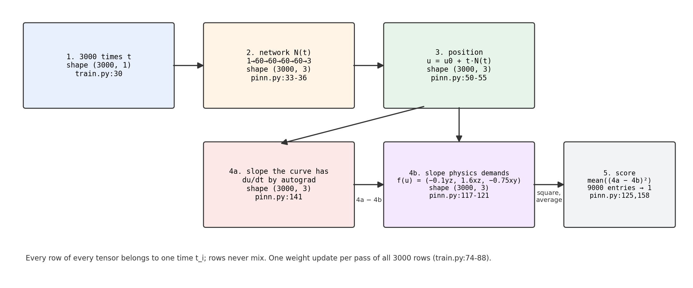
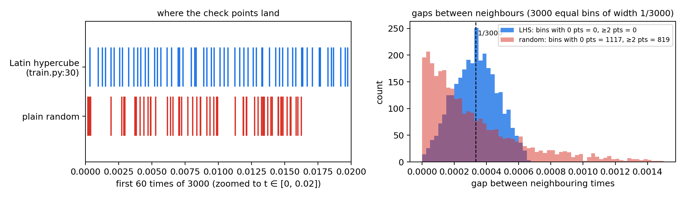
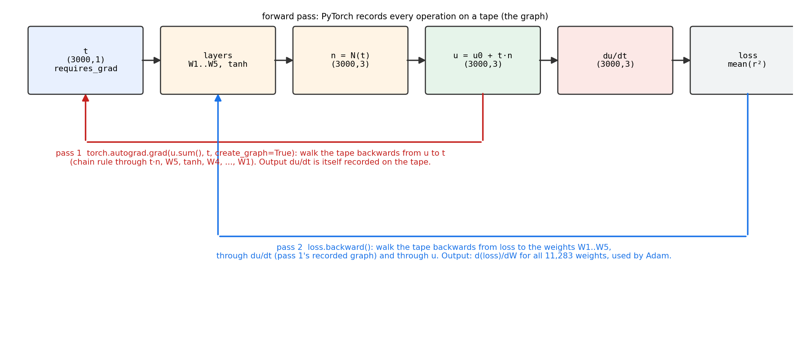

# Our PINN training approach

**Project:** FYDP-2, Lorenz-1960 PINN · **Branch:** `feat/sequential-rollout` · September 2026

## What we are solving

Lorenz's 1960 system: three numbers x, y, z whose rates of change depend on
each other (`dx/dt = −0.10·y·z`, `dy/dt = 1.60·x·z`, `dz/dt = −0.75·x·y`). We
know the starting point (0.5, 0.75, 1.0) and want the solution on t ∈ [0, 1].
The network is never shown the answer — it learns from the equations alone.
The trusted answer used for scoring comes from SciPy's DOP853 solver
(rtol 1e-10).

## The batched approach (our method)

The network is given a time and answers with a position (x, y, z). We never
show it the true path. Instead we pick 3000 times between 0 and 1 (Latin
hypercube sampling, so they spread evenly, and the same 3000 for the whole
run; `train.py:30`) and hand all of them to the network at once as one
3000 × 1 column. The network is small: one input, four layers of 60 tanh
units, three outputs, 11,283 weights (`pinn.py:33-36`). Its raw output is not
used directly. We wrap it as u(t) = u0 + t·N(t), so at t = 0 the answer is
the known start (0.5, 0.75, 1.0) whatever the weights are; the initial
condition is built in rather than learned (`pinn.py:50-55`). PyTorch then
differentiates this u(t) with respect to time, exactly, at all 3000 rows in
one call; the flag `create_graph=True` keeps that derivative connected to the
weights so training can push on it (`pinn.py:141`; step 4a below explains
the mechanism). The equation itself lives in one small function that takes
the network's positions and returns the slope the physics demands,
(−0.10·yz, 1.60·xz, −0.75·xy) (`pinn.py:117-121`).
The residual is the gap between the slope the curve has and the slope the
equation wants, one row per time and one column per variable
(`pinn.py:125`), and the loss is the mean of its square over all 9000 entries
(`pinn.py:158`). Each epoch is one forward pass of the 3000 rows, one
backward pass, one Adam step; 20,000 epochs with the learning rate easing
from 1e-3 to 1e-4 (`train.py:74-88`). Evaluating all 3000 points together
does not change the answer, only the speed: row i of every tensor depends
only on time t_i, so the gradient from one batched pass is the same as from
3000 separate passes added up. A test in the suite trains both ways and
checks the weights agree to 32-bit round-off (`test_pinn.py:480-525`); the
section after the epoch loop shows that test and how the sequential walk
breaks this independence on purpose.



*Figure 1. The five tensors one epoch builds, left to right. Every box is
3000 rows, one row per check time.*

### Step by step, with the code and the paper behind each step

**1. The 3000 check times.** `src/pinn/train.py:27-32`

```python
def make_grid(cfg, device):
    # Latin hypercube sampling over [t0, tf], following Matthews & Bihlo (PinnDE).
    t0, tf = cfg.t_span                                                    # (0.0, 1.0)
    sample = qmc.LatinHypercube(d=1, seed=cfg.seed).random(cfg.n_collocation)   # 3000 values in [0, 1)
    t = t0 + (tf - t0) * sample
    return torch.as_tensor(t, dtype=torch.float32, device=device).reshape(-1, 1)  # shape (3000, 1)
```

Latin hypercube sampling cuts [0, 1] into 3000 equal slots and puts one
random time in each slot. Plain random sampling would leave some slots empty
and stack others; with seed 0, plain random leaves 1117 of the 3000 slots
empty and puts two or more points in 819 of them, while LHS leaves none
empty and none doubled (Figure 2, computed with the exact code above). The
average gap between neighbours is 1/3000 = 3.3e-4 either way; LHS just
removes the big holes. The `seed` makes the same 3000 times come back every
run, and `make_grid` is called once (`train.py:41`), so the times never
change during training. This is the recipe of the PinnDE library (Matthews &
Bihlo, arXiv:2408.10011), which the comment in the code names. Values:
`n_collocation = 3000`, `t_span = (0.0, 1.0)` in `config.py:45` and `:30`.



*Figure 2. Left: the first 60 of 3000 times, LHS versus plain random. Right:
histogram of gaps between neighbouring times; LHS has no gap above 6.6e-4,
plain random reaches 3.8e-3.*

**2. The network.** `src/pinn/pinn.py:33-41`

```python
layers = [nn.Linear(1, cfg.width), act()]              # 1 -> 60, tanh
for _ in range(cfg.depth - 1):                         # three more times:
    layers += [nn.Linear(cfg.width, cfg.width), act()] # 60 -> 60, tanh
layers.append(nn.Linear(cfg.width, 3))                 # 60 -> 3, no activation
self.net = nn.Sequential(*layers)
for m in self.net:
    if isinstance(m, nn.Linear):
        nn.init.xavier_uniform_(m.weight)              # Glorot start
        nn.init.zeros_(m.bias)
```

`depth = 4`, `width = 60`, `activation = "tanh"` (`config.py:32-34`). The
whole 3000 × 1 column goes in and a 3000 × 3 block comes out, one matrix
multiply per layer; row i of the output depends only on row i of the input.
The network output `n = self.net(t)` (`pinn.py:130`) is only a raw guess at
this point. A fully connected tanh network fed with the coordinates is the
form used in the original PINN paper (Raissi, Perdikaris & Karniadakis,
J. Comput. Phys. 378, 2019, doi:10.1016/j.jcp.2018.10.045).

**3. The position, with the start point built in.** `src/pinn/pinn.py:50-55`

```python
def trial(self, t, n):
    if self.ic == "hard":
        g = (t - self.t0) / (self.tf - self.t0)   # equals t, because t0 = 0 and tf = 1
        return self.u0 + g * n                     # u(t) = u0 + t * N(t), shape (3000, 3)
    return n
```

`u0 = (0.5, 0.75, 1.0)` is stored in the model as a fixed buffer
(`pinn.py:46`, value from `config.py:29`). Because the factor `t` is zero at
the start, `u(0) = u0` for any weights; the test `test_hard_ic_exact`
(`test_pinn.py:10-14`) checks this on a fresh, untrained network. The idea is
from Lagaris, Likas & Fotiadis (IEEE Trans. Neural Netw. 9(5), 1998,
doi:10.1109/72.712178), who wrote the trial solution as a fixed part that
satisfies the condition plus a network part multiplied by something that
vanishes there. The same form is used for the Lorenz-63 system by Wang,
Sankaran & Perdikaris (CMAME 421, 2024, Appendix E): `x̂(t) = x_θ(t)·t + x(0)`.
The alternative, a penalty term `γ·|N(0) − u0|²` (Raissi 2019), is still in
the code as `ic="soft"` (`pinn.py:159-162`) but is not what we run, because it
adds a weight γ to tune and never makes the start exact.

**4a. The slope the curve has.** `src/pinn/pinn.py:141-142`

```python
cols = [torch.autograd.grad(u[:, j].sum(), t, create_graph=True)[0][:, 0] for j in range(3)]
dudt = torch.stack(cols, dim=1)                        # du/dt, shape (3000, 3)
```

This is not a finite difference and not a formula we typed in. It is
automatic differentiation, and it works in three moves.

*Move 1, the tape.* During the forward pass PyTorch does not only compute
numbers; it also records every operation it performed (multiply by W1, add
b1, tanh, ..., multiply by t, add u0) and which tensor fed which. This record
is the computational graph. Derivatives can only be asked for with respect
to tensors that were marked `requires_grad=True` before the forward pass.
The weights are marked by default; the time column is not, which is why the
training loop hands in `grid.clone().requires_grad_(True)` (`train.py:75`):
it declares `t` as something we will want derivatives with respect to.

*Move 2, walking the tape backwards.* `torch.autograd.grad(u[:, j].sum(), t)`
asks: how does the sum of column j of `u` change if `t` changes? PyTorch
starts at that sum and walks the recorded operations in reverse, applying
the chain rule at each one with the local derivative it knows for that
operation (the derivative of tanh is 1 − tanh², the derivative of `t·n` with
respect to `t` is `n + t·dn/dt`, and so on). For our one-hidden-layer
sketch, `u = u0 + t·(W2·tanh(W1·t + b1) + b2)`, the walk produces exactly
`du/dt = N(t) + t·W2·(1 − tanh²(W1·t + b1))·W1`, which is the textbook
derivative. The four-layer network is the same idea with more steps. Because
each row of `u` was built only from its own `t_i`, the derivative of the
column sum with respect to `t_i` is just the derivative of row i; the
`.sum()` is what lets one call return all 3000 slopes instead of 3000 calls.
This reverse walk is called reverse-mode automatic differentiation; the
standard reference is Baydin, Pearlmutter, Radul & Siskind (J. Mach. Learn.
Res. 18(153), 2018, arXiv:1502.05767), and the PyTorch implementation is
described in Paszke et al. (NeurIPS 2019, arXiv:1912.01703).

*Move 3, keeping the derivative trainable.* Normally a backward walk
produces plain numbers and the tape is discarded. `create_graph=True` tells
PyTorch to record the backward walk itself as new operations on the tape.
The result `du/dt` is then not a constant but a function of the weights,
with its own recorded history. That matters because the loss is built from
`du/dt`: when `loss.backward()` runs (`train.py:77`), it walks the tape a
second time, now from the loss to the 11,283 weights, and part of that route
goes through the recorded first walk. In plain terms, training can move the
weights so that the curve's *slope* fits the equation, not only its
position. Without the flag the slope is frozen at its current value and the
gradient is wrong. We measured this: 2000 Adam epochs from the same seed
reach loss 3.6e-7 and RMSE 8.6e-5 against the reference with the flag, and
loss 6.3 with RMSE 0.92 without it; the run does not just slow down, it
diverges.



*Figure 3. One epoch's forward pass (black), the derivative pass that
produces du/dt (red), and the training pass to the weights (blue). Both
coloured passes reuse the same recorded tape.*

Raissi 2019 obtains the derivatives in the residual by automatic
differentiation in exactly this way; the PINN idea depends on it.

**4b. The slope the physics demands.** `src/pinn/pinn.py:117-121`

```python
def ode_rhs(u, coeffs):
    c = torch.as_tensor(coeffs, dtype=u.dtype, device=u.device).reshape(3)
    x, y, z = u[:, 0], u[:, 1], u[:, 2]
    return torch.stack([c[0] * y * z, c[1] * x * z, c[2] * x * y], dim=1)   # f(u), shape (3000, 3)
```

The Lorenz-1960 right-hand side, evaluated at the positions the network just
claimed. The three coefficients are not typed in by hand; they come from the
wavenumbers k = 2, l = 1 through `src/baseline/lorenz1960_baseline.py:28-32`
(`c_x = kl(1/(k²+l²) − 1/k²) = −0.10`, `c_y = kl(1/l² − 1/(k²+l²)) = 1.60`,
`c_z = ½kl(1/k² − 1/l²) = −0.75`), the same code the reference SciPy solver
uses, so the network and the reference solve the same equation. The test
`test_residual_zero_on_truth` (`test_pinn.py:17-25`) feeds the SciPy solution
through this function and checks the residual is near zero, which confirms
the physics is written correctly before any network is involved.

**5. The score.** `src/pinn/pinn.py:125`, `:158`

```python
r = dudt - ode_rhs(u, coeffs)      # residual, shape (3000, 3): one entry per time and variable
res = parts.r.pow(2).mean()        # mean of r² over all 9000 entries: one number
```

Each entry of `r` says how much the network's curve breaks the equation at
one time for one variable; a true solution has `r = 0` everywhere. Averaging
the squares gives the single number Adam minimises. With the hard start point
there is no second term (`ic = 0`, `pinn.py:162-163`), so the loss is purely
physics. The test at `test_pinn.py:152-155` checks that the per-point
contributions written to disk add up to this same loss. Minimising the
squared residual at sampled points is the PINN loss of Raissi 2019.

The epoch loop (`src/pinn/train.py:74-77, 87-88`):

```python
adam.zero_grad()
res, ic, parts = loss_terms(model, grid.clone().requires_grad_(True))
loss = res                                  # no IC term with the hard start point
loss.backward()
adam.step()
sched.step()
```

### Why checking all 3000 points at once is exact, and how the sequential walk differs

Look at the shapes in Figure 1 again: every tensor is 3000 rows, and row i
of each one was computed from row i of the one before. The network sees
`t_i` alone (step 2), the position uses `t_i` and `N(t_i)` alone (step 3),
the slope is the derivative of row i with respect to `t_i` alone (step 4a),
the physics uses row i of the position alone (step 4b). So residual `r_i`
is a function of the weights and of `t_i`, and nothing else. The loss is
the mean of 3000 such independent terms, and the derivative of a mean is
the mean of the derivatives. Therefore the gradient that `loss.backward()`
returns from one batched pass is, term for term, the same as running the
3000 points one at a time and adding up their gradients. Batching changes
how many times the GPU is called, not what it computes.

We do not ask anyone to take this on trust; two tests in the suite check it.
The first (`test_pinn.py:456-477`) computes the residuals for a batch, then
recomputes eight of the points on their own, and checks the numbers match.
The second (`test_pinn.py:480-525`) trains the same network twice from the
same seed, once batched and once with a literal Python loop over every
point, and compares the trained weights:

```python
if mode == "batched":
    loss = residual_parts(model, grid.clone().requires_grad_(True)).r.pow(2).mean()
    loss.backward()
else:
    for i in range(cfg.n_collocation):                       # one point at a time
        r = residual_parts(model, grid[i:i+1].clone().requires_grad_(True)).r
        share = r.pow(2).sum() / (3 * cfg.n_collocation)      # this point's share of the mean
        share.backward()                                      # gradients accumulate
adam.step()
...
assert (np.abs(batched - looped) / np.abs(batched)).max() < 1e-5   # loss curves agree
assert torch.allclose(params["batched"], params["looped"], rtol=1e-3, atol=0)   # weights agree
```

The tolerance is set at 32-bit round-off, and the test passes.

**How the sequential walk is different.** In the sequential branch the same
3000 points go through the same network, but the position at `t_i` is built
by adding up the slopes at every earlier point (`pinn.py:113`,
`u = u0 + cumsum(dt * slope)`). Row i now depends on rows 1 to i − 1. The
residuals are no longer independent, the loss is not a sum of separate
terms, and the batched-equals-looped argument does not hold; the walk *must*
be evaluated as one connected chain, with gradients flowing back through
all 3000 steps. That coupling is the whole point of the walk, and it is also
where its error accumulates (see the next section).

**What the recent literature says about this choice.** The sequential
methods in the PINN literature are time-marching schemes: split the time
axis into windows and train a batched PINN on each window in turn. The most
recent practitioner's guide from the group that introduced causal training,
Wang, Sankaran, Wang & Perdikaris, *An Expert's Guide to Training
Physics-informed Neural Networks* (2023, arXiv:2308.08468), calls the
batched single-domain method "one-shot learning" and is explicit about the
trade: time-marching becomes necessary only as the time horizon grows
(their Figure 12 shows the one-shot error rising with the final time T on a
chaotic problem), and "the computational cost of time-marching is
considerably larger than one-shot learning as one needs to train multiple
PINN models sequentially" (§7.4). Inside every window, their method is the
batched residual loss of steps 1 to 5. The same holds in Wang et al. (CMAME
2024, Appendix E) for the chaotic Lorenz-63 system: 40 windows of length
0.5, each one a batched hard-IC PINN. Our horizon [0, 1] is two such windows
and the system is not chaotic, so one-shot is what the literature would
prescribe here, and it is what we run.

One honest difference from that guide: they recommend drawing a fresh random
batch of collocation points every iteration (§6.2) to save memory and
regularise, while we keep one fixed LHS set of 3000 points for the whole
run, following PinnDE. On our problem the fixed set reaches RMSE 1.7e-5
against the reference, and the error against the reference falls together
with the training loss for the whole run (rank correlation 0.92 over the 201
checkpoints in `runs/4x60/history/reference_error.csv`, final value within
4% of the minimum), so we see no sign of the over-fitting they warn about;
on a larger problem their advice would apply.

## Why we did not use sequential marching

We did not reject it without testing. We implemented it (branch
`feat/sequential-rollout`) and even upgraded it to its best form — a
second-order (trapezoid) walk. Same problem, same budget in all three runs:
3000 points, 20,000 Adam epochs.

| run | scheme | error vs truth (RMSE, combined) |
|---|---|---|
| `runs/4x60` | **our batched single-domain** | **1.7e-5** |
| `runs/4x60_seq` | sequential march, second-order (best) | 8.2e-5 |
| `runs/4x60_seq_euler` | sequential march, first-order | 1.2e-4 |

*Evidence: each row is a completed 20,000-epoch run; numbers in
`runs/<name>/run_summary.csv`.*

Sequential marching walks forward from the start, predicting slopes and
adding them up. We removed its discretization error (measured floor 1.7e-7,
proven by test `test_pinn.py:386-417`) and it still lands about 5× further
from the truth. The reason is structural, not tuning: the walk **integrates
its own mistakes** — a slope error at one time becomes a position error at
every later time — while in our approach each point's error stays local. Both
methods drive the physics loss to ~1e-9; at equal loss, the walked curve is
simply less accurate. The marched version also only defines a curve on the
grid it is walked on, whereas our trained network is a true function of t,
evaluable at any time.

The literature agrees on where marching helps: long time horizons and chaotic
systems, where single-domain training struggles (Krishnapriyan et al., NeurIPS
2021; Mattey & Ghosh, CMAME 2022). Our benchmark is short and smooth
(t ∈ [0, 1], 0.5 to 1.6 in value), so those benefits never engage. Re-testing
marching on a longer horizon is planned future work.

**"But don't those papers say sequential is the better approach?"** Not for a
problem like ours — and their own method shows why. What they call
"sequential" is our batched method applied to short time windows one after
another. Wang et al. (CMAME 2024, Appendix E) solve the chaotic Lorenz-63
system on t ∈ [0, 20] by cutting it into 40 windows of length 0.5 and, inside
each window, training a network that outputs the state with the initial
condition built in as `x(t)·t + x(0)` — the same network, same built-in start
point (`pinn.py:50-55`), and same physics check (`pinn.py:141`, `pinn.py:158`)
as ours. Our whole problem is only two of their windows long, so on [0, 1]
their recipe *is* our recipe. The sequential literature also documents its
own cost — error carried forward from window to window (Lin & Chen 2023,
arXiv:2312.06715) — which is exactly the accumulation we measured in the
walk above. Full argument with quotations: `docs/two-training-modes.md` §5.4.

## Bottom line

Batched single-domain training is our method: more accurate (1.7e-5 vs 8.2e-5),
exact by test, simpler, and it yields a function of time rather than a
grid-bound curve. The sequential version is kept on its branch, fully tested,
with a documented structural reason for its lower accuracy — so the comparison
is a result, not an omission.
