# Run A (batch) vs Run B (causal windows) on one closed Lorenz-1960 orbit

> **Historical interpretation, superseded.** The later [code and artifact audit](2026-09-22-two-branch-code-audit.md)
> identifies incompatible loss definitions, pre-L-BFGS Run A point figures,
> untrained future windows in Run B progress figures, and unsupported precision,
> landscape, NTK, and error-growth conclusions below. Use the audited metric
> table and [repair note](2026-09-22-causal-window-repair.md) for current claims.
> Neither run has been retrained.

Both runs: 4x60 tanh, float64, hard IC `u = u0 + (t - t0) N(t)`, t in [0, 13.26446]
(one closed orbit), 39 793 collocation points, 13 265 evaluation points, Colab T4.

| | Run A `runs/4x60_f64_unit` | Run B `runs/4x60_f64_unit_win27_causal_warm` |
|---|---|---|
| scheme | one network, mean-squared residual, 40 000 Adam + 5000 L-BFGS | 27 windows of 0.49, causal weights, eps (1e-2, 1e-1, 1, 10), <= 4000 Adam per stage, 1500 L-BFGS per window, warm start |
| RMSE (x, y, z) | 0.38, 2.08, 0.74 | 2.8e-5, 5.9e-5, 5.3e-5 |
| max abs error | 3.35 | 2.4e-4 |
| final loss | 2.8e-4 (plateau) | 1.5e-7 over the orbit, 4e-9 to 7e-7 per window |
| iterations | 45 000 | 78 677 (about 100 Adam + 1 500 L-BFGS per window; 6 windows hit the 4000 cap) |
| wall | 75 min | 15.5 min |

Where everything is: open `runs/index.html` in a browser. It lists every figure, page, film and
table of both runs in one table. Each run also has `figures/` (png + interactive html), `film/final.mp4`,
`history/` (loss, marks, weights) and `run_summary.csv`.

The two results in one sentence: the batch network settled on a smooth wrong curve and could not leave it;
the windowed causal network followed the whole orbit with error 1e-5 to 2e-4 and closed it at 3e-5.

---

## 1. Comparison

### Side-by-side page

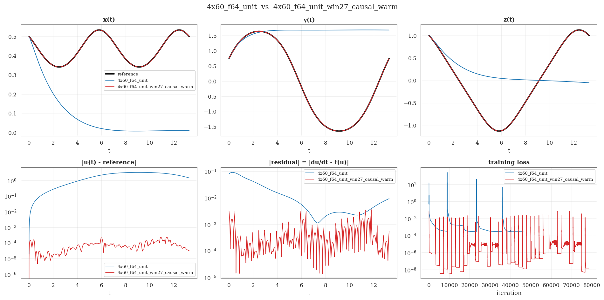

**How to read.** Top row: x(t), y(t), z(t). Black is the reference solution (DOP853, tolerance 1e-10),
blue is Run A, red is Run B. Bottom left: distance from the reference at every t, log scale. Bottom middle:
size of the ODE residual `du/dt - f(u)` at every t. Bottom right: training loss per iteration.

**Finding.** Run A (blue) decays to a constant (x to 0.01, y to 1.7, z to 0) while the reference
oscillates; its error grows to 3 within two time units and never recovers. Run B (red) lies on the black
curve everywhere; error stays between 1e-5 and 2e-4 for the full orbit and does not grow window to window.
Run B's residual has a bump at every window start (the learned initial slope of each window), which is the
main error source now. The loss panel shows why Run A failed: it reaches 2.8e-4 by iteration 8 000 and stays
there for 37 000 more, including all of L-BFGS.

### Precision floor

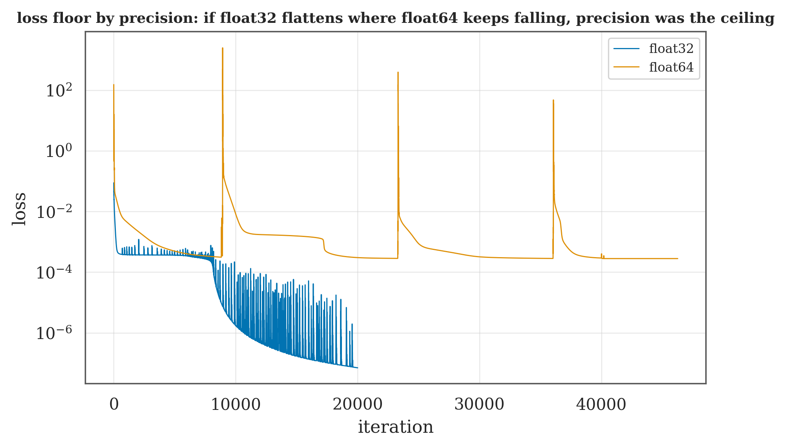

**How to read.** Loss per iteration for the earlier float32 run on [0, 10] and Run A in float64, same
network and scheme. If float32 flattens where float64 keeps falling, precision was the ceiling.

**Finding.** Both flatten at the same level, so precision was not the ceiling for the batch scheme: the
plateau is a property of the loss, not of the arithmetic. float64 still matters for Run B, whose per-window
losses reach 4e-9, below what float32 L-BFGS can resolve (tolerance 1e-14 vs 1e-16).

---

## 2. Films (`film/final.mp4` in each run)

Run A: `runs/4x60_f64_unit/film/final.mp4`. Run B: `runs/4x60_f64_unit_win27_causal_warm/film/final.mp4`.

**How to read.** Act 1 (*Learning the loop*): the grey loop is the reference orbit in 3-D; the coloured
curve is the network's prediction at successive snapshots, blue where it matches, red where the error is
above 1e-3. Act 2 (*Descending the surface*): the loss surface on the two main directions the weights moved
in, with the optimiser's path drawn on it; yellow arrows point along the negative gradient. Act 3 (Run B only,
*The causal front*): the weight profile w(t) inside the window at successive snapshots; the step from 1
to 0 is the front.

**Finding.** Run A's curve turns red from the second time unit onward and then stops changing shape: the
film shows a plateau, not slow learning. Run B's curve turns blue window by window from left to right; the
front in act 3 always starts at the left edge of a window and has to reach the right edge before eps advances.
Snapshots are every 2 000 iterations, so the fast windows (about 100 Adam iterations each) are only caught
in act 1 through their finished state; the six capped windows are seen mid-training.

---

## 3. Trajectory in 3-D

### `figures/trajectory.html` (interactive, both runs)

**How to read.** Plotly page: drag to rotate, scroll to zoom. Grey = reference orbit, coloured = prediction,
with a slider over training snapshots. Hover gives t and the error at that point.

**Finding.** Run A collapses toward the centre of the loop (the fixed point the constant solution sits at).
Run B's final curve is indistinguishable from the reference at any zoom the page allows; the last slider
position is the finished model.

### Phase portraits

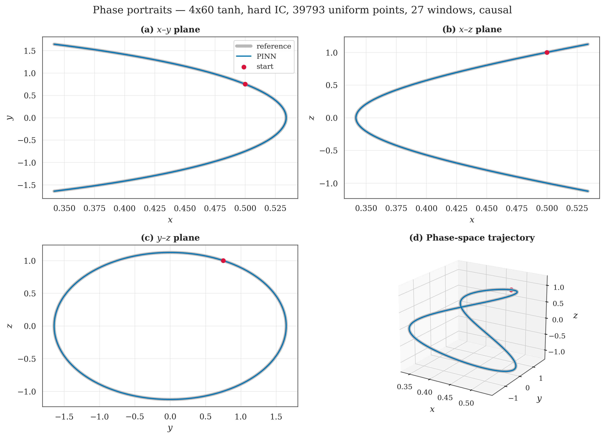

**How to read.** The same orbit projected on the x-y, x-z, y-z planes and in 3-D; grey is the reference,
blue the prediction, red dot the initial state. A closed orbit must come back to the red dot.

**Finding.** Run B closes the loop to within 3e-5 (the blue and grey curves overlap at the red dot). Run A's
version of this figure is a curve spiralling into the centre of the y-z ellipse.

### Solution vs reference (`figures/solution_vs_reference.png`)

**How to read.** x, y, z against t, prediction over reference, with the residual below.

**Finding.** Same content as the top row of the comparison page; kept per run so each figure set is complete.

---

## 4. Training dynamics

### Loss by phase

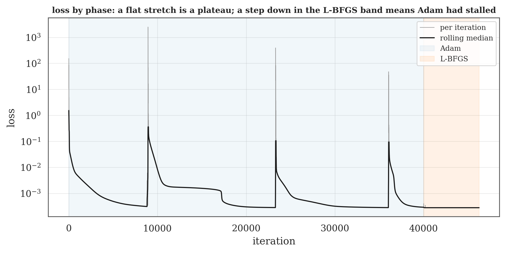
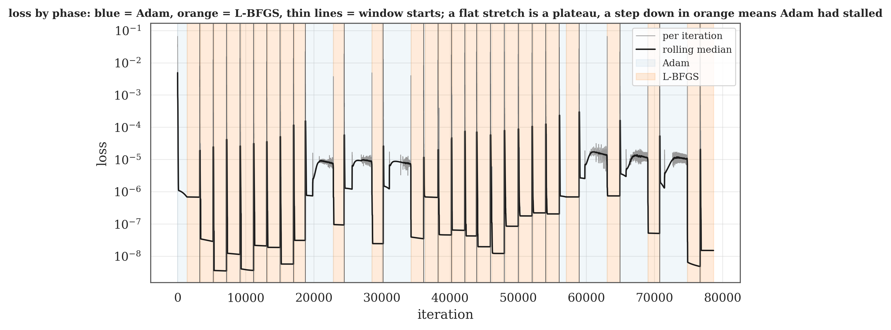

**How to read.** Grey is the loss at every optimiser step, black a rolling median. Blue shading = Adam,
orange = L-BFGS; thin vertical lines are window starts. A step down inside orange means Adam had stalled and
the second-order optimiser found more. In Run B the loss inside blue is the *causally weighted* loss, inside
orange the plain mean.

**Finding.** Run A: three blow-ups (loss to 1e3 at iterations about 9 000, 23 000, 36 000). After each, Adam
returns to exactly the same 2.8e-4: the plateau is an attractor, not a slow descent. L-BFGS (orange) does
not move it. Run B: each window drops from about 1e-2 to about 1e-6 in about 100 Adam steps; L-BFGS then takes it to
1e-7 to 1e-8. The six wide blue regions (windows 9-11, 23-25) are the eps=10 stage running to the 4 000 cap in
a noisy 1e-5 band (Adam at lr 1e-3 cannot sit in a 1e-6 basin) and L-BFGS repairs it every time. Almost
all of Run B's iterations are L-BFGS.

### Loss per window (Run B)

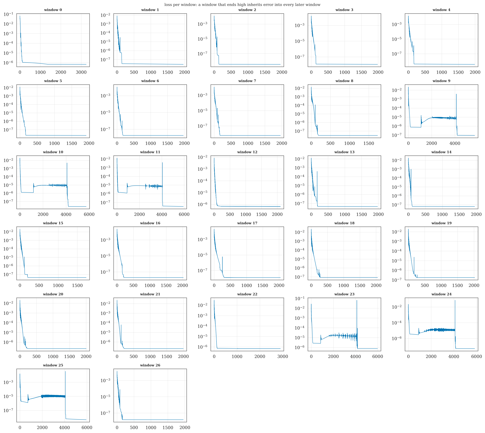

**How to read.** One panel per window, loss against iterations inside that window. Compare panels by the
level they end at: a window that ends high hands a worse initial state to the next.

**Finding.** 21 of 27 windows finish in about 2 000 iterations and end at 1e-8 to 1e-7. Windows 9, 10, 11 (t 4.4-5.9)
and 23, 24, 25 (t 11.3-12.8) are the ones where the eps=10 stage never reached min w > 0.99: these are the
fastest parts of the orbit (x at its extremes). In those panels the loss *rises* from 1e-6 to 1e-5 when the
eps=10 stage starts, then L-BFGS brings it down again. Window 0 ends at 6.7e-7, the worst of all: it starts
from random weights while every later window warm-starts.

### Minimum temporal weight (Run B)

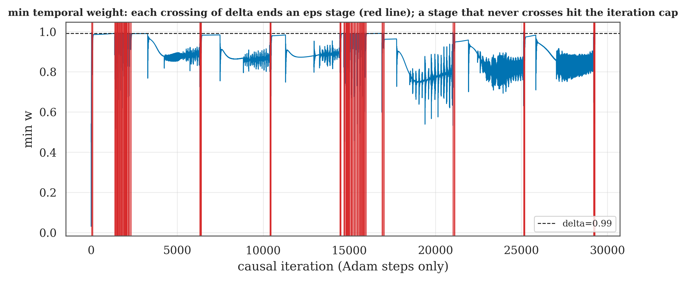

**How to read.** min w = the weight of the last point in the current window, against Adam steps only
(L-BFGS steps are not counted here). Dashed line = delta 0.99. Each red line is the end of an eps stage. A
stage that crosses the dashed line ends early; one that runs 4 000 steps without crossing hit the cap.

**Finding.** Stages 1-3 cross within 8-60 steps in every window (the dense clusters of red lines). Only the
eps=10 stage ever runs long, and only in the six fast windows, where it oscillates between 0.75 and 0.9: the
sum of earlier residuals stays around 1e-2/eps and the last point never gets its full weight. The rule
"advance when min w > delta" from Wang et al. is doing exactly what the paper describes; what it exposes is
that eps=10 with lr 1e-3 is too strict for a window that is already at 1e-6.

### Causal weight profiles (Run B)

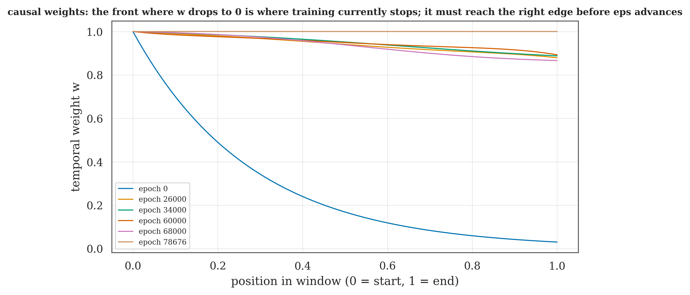

**How to read.** w against position in the window (0 = start, 1 = end) at six snapshots. w is 1 at the
start of every window by construction and falls with the accumulated residual of earlier points. Training
effectively stops where the curve reaches 0.

**Finding.** At epoch 0 (fresh network, eps 0.01) the profile falls to 0.03 at the window end: the first
window really is trained left to right. Every later snapshot lands in a capped eps=10 stage, where the
profile only falls to 0.8-0.9: the front has almost reached the right edge but not to the 0.99 needed.

### Residual field over training (both runs)

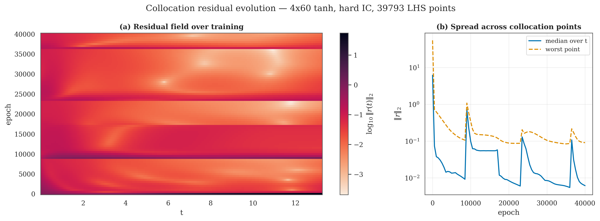
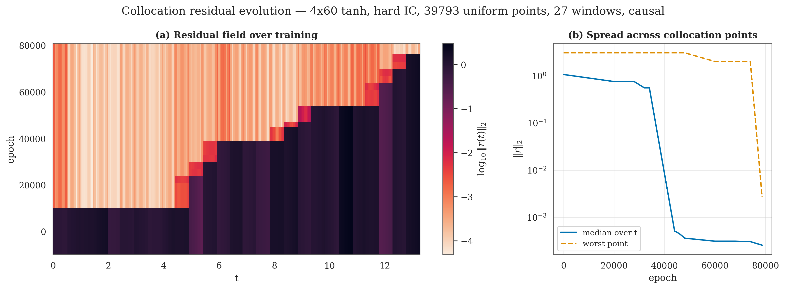

**How to read.** Left: residual size at every collocation point (x axis = t) at every snapshot (y axis =
iteration), log colour scale, light = small. Right: median and worst residual over t at each snapshot.

**Finding.** Run A: horizontal bands. The whole time axis improves and worsens together, the three
blow-ups appear as dark stripes, and the field never gets below 1e-2 anywhere after t = 1. Run B: a staircase.
The light region grows from left to right, one window at a time, and nothing to the left of the front ever
gets worse again. The worst point drops from 3 to 2.7e-3 only at the very end because the last windows are
trained last. (Snapshots were every 2 000 iterations; the fast windows 0-8 fell between snapshots, so the
first step of the staircase looks like one jump. Future runs snapshot at every window end.)

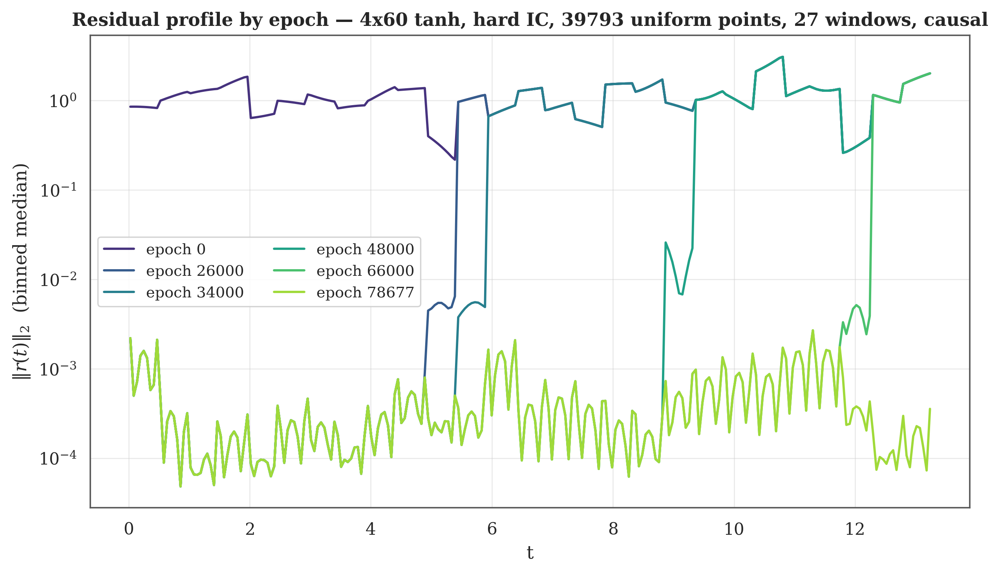

**How to read.** Six horizontal cuts through the field above: residual against t at chosen snapshots.

**Finding.** The finished profile (epoch 78 677) is 1e-4 to 1e-3 everywhere, with the spikes at window
starts; the mid-training profiles show the wall at the front, three orders of magnitude between trained and
untrained t.

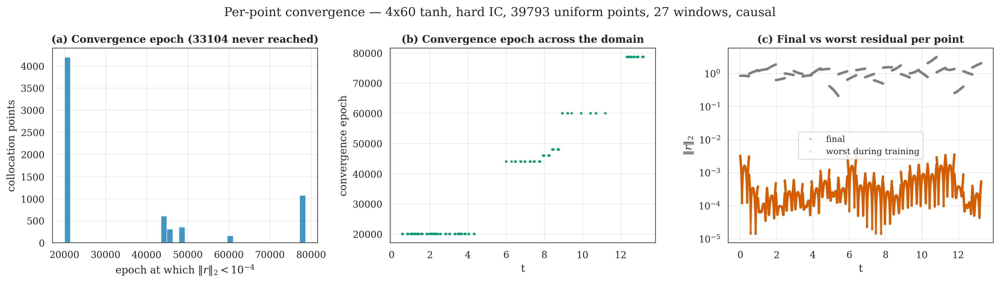

**How to read.** (a) histogram of the first snapshot at which each point's residual norm was below 1e-4; (b)
that iteration against t; (c) each point's final residual (orange) and worst residual during training (grey).

**Finding.** The threshold 1e-4 is at the level of the final residual, so only 17 % of points are counted
as converged. Treat (a) and (b) as showing the order in which regions were reached (t < 4.4 at 20 000,
t 6-9 at 44 000-48 000, t 9-11 at 60 000, the last two windows at 78 000), not as a convergence failure.
Panel (c) is the useful one: every point starts near 1 and ends between 1e-5 and 3e-3.

### Training dynamics page

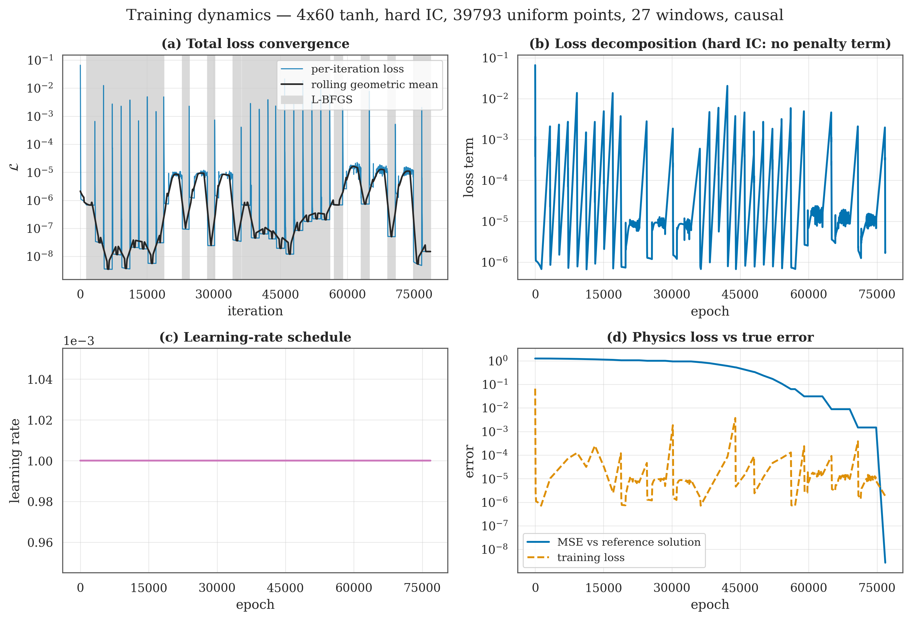

**How to read.** (a) loss per iteration with L-BFGS shaded; (b) the residual term alone (the only term, hard
IC); (c) learning-rate schedule; (d) training loss (orange) against the true mean-squared error on the
reference grid (blue), both against iteration. Run A's page has the same layout.

**Finding.** Panel (d) for Run B looks alarming and is correct: the blue MSE is over the *whole* orbit, so
it stays near 1 until the last windows are trained, then falls to 7e-9 (= 8.4e-5 squared). Panel (c) shows
the lr never decayed: StepLR decays every 5 000 Adam steps per window and no window used that many. For Run A
panel (d) shows loss and MSE decoupled, loss 2.8e-4 with MSE about 5, which is the definition of a wrong minimum.

---

## 5. Gradient descent

### Loss landscape

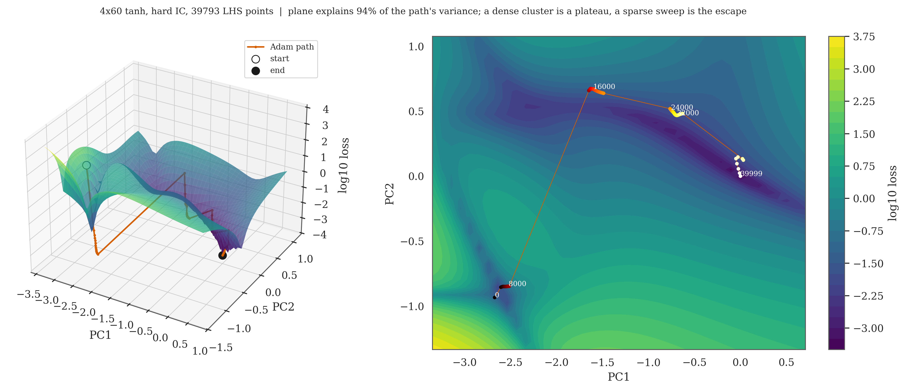
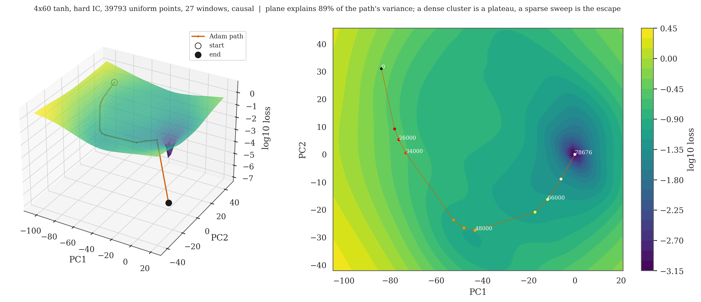

**How to read.** PCA of the weight snapshots gives the two directions the weights moved most along; the
surface is the loss evaluated on that plane (Li et al. 2018), centred on the final weights. The orange path is
the optimiser's trajectory projected onto the plane, with its height measured with the same loss. The title
says how much of the path's movement the plane captures. Interactive version: `figures/loss_landscape.html`;
the weight path alone in three components: `figures/weight_path_pca3.html`.

**Finding.** Run A: four tight clusters joined by three long jumps (the three Adam blow-ups), and every
cluster sits at the same height (log10 loss about -3.5). The batch loss has a family of equally bad basins and
Adam hopped between them. Run B: one long descent into a single narrow well; the last drop from 1e-3 to
1e-7 is narrower than the 60x60 grid can resolve, so the surface's minimum reads -3.2 while the path ends at
-6.8. For Run B the plane is built from all 27 windows' weights, so PC1/PC2 mostly track which window is
training; read it as one network moving through time.

### Gradient direction stability

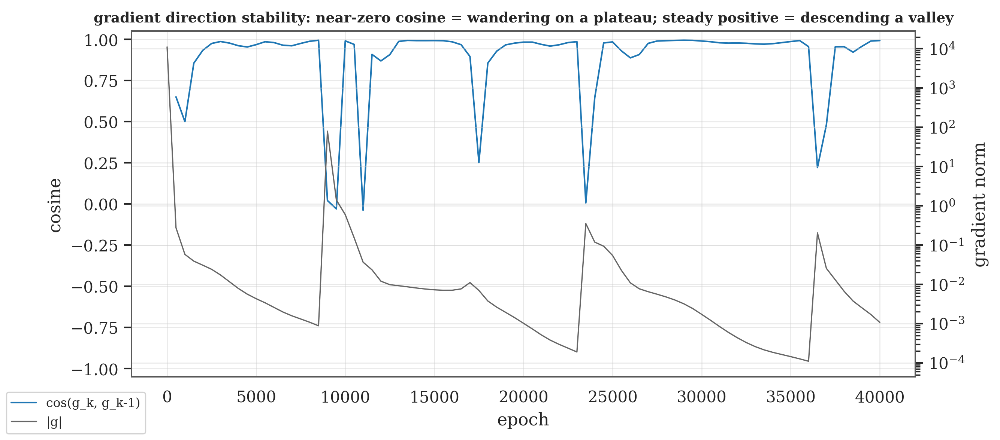
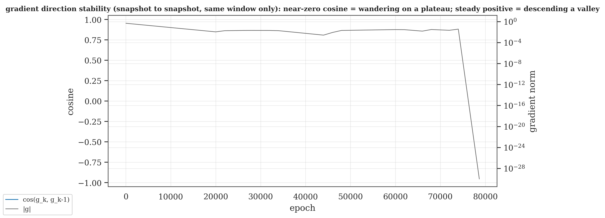

**How to read.** Blue: cosine between the gradient at one snapshot and the previous one (1 = same direction,
0 = unrelated, -1 = reversed). Grey: gradient norm. In Run B the cosine is blank where two snapshots fall in
different windows (different networks, comparison meaningless).

**Finding.** Run A: cosine about 1 almost throughout while |g| decays from 1e4 to 1e-4. The gradient keeps
pointing the same way and keeps shrinking: a long flat valley, not random wandering. The three dips to 0
coincide with |g| jumping from 1e-4 to 1e2. Adam's step is lr * m / sqrt(v), and once the gradient has been
tiny for long enough the denominator has decayed, so the next ordinary gradient produces a huge step. That is
the blow-up mechanism. Run B: with 2 000-step snapshots there are at most two consecutive snapshots inside
any window, so this figure is nearly empty; use the layer norms below instead.

### Gradient norm per layer, per-layer histograms, gradient diagnostics

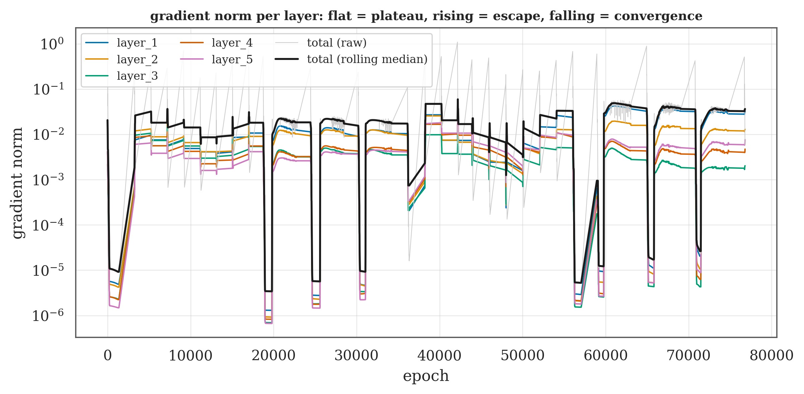

**How to read.** Gradient norm of each layer at every logged step, plus the total; log
scale. Flat = plateau, rising = leaving one, falling = converging. `gradient_histograms.png` shows
the distribution of |grad| per layer at four snapshots; `gradient_diagnostics.png` adds the step size
|theta_k+1 - theta_k| and a gradient-norm-vs-loss scatter.

**Finding.** Run B: each window is a plateau at 1e-2 in every layer (the eps stages) with a dip to
1e-6 at the *start* of each capped eps=10 stage. At that moment almost every point has weight about 0, the
weighted loss and its gradient are tiny, but Adam still takes lr-sized steps because it normalises by the
running gradient scale; those steps damage an already-converged window, which is the 1e-6 to 1e-5 rise seen
in the window grid. The layers are balanced (all within a factor of 10), so no layer is dead. Run A: all
layers decay together to 1e-4 then jump at each blow-up, the same story as the cosine figure.

### NTK spectrum

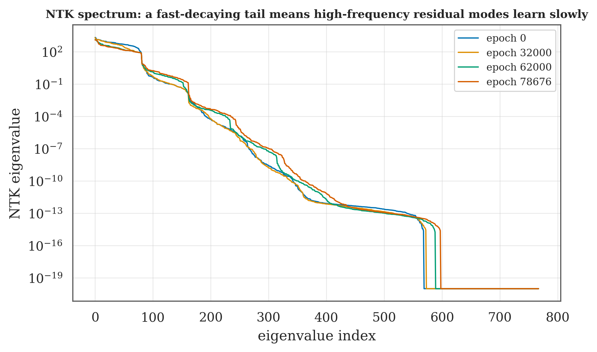

**How to read.** Eigenvalues of J J^T (J = derivative of the residual at 256 sample points with respect to
every weight), sorted, log scale, at four snapshots. Large eigenvalues are residual patterns the network can
fix quickly; the tail is what it learns slowly. A fast-decaying tail is spectral bias.

**Finding.** Both runs: the spectrum spans 1e2 to 1e-13 over about 600 modes and barely changes during training.
The network's ability to move the residual is set at initialisation and is the same for both schemes. The
difference between A and B is therefore not the network; it is the loss. For Run B the kernel is
block-diagonal (each point only depends on its own window), so the spectrum is the union of 27 small ones.

---

## 6. Evaluation

### Error and residual along t

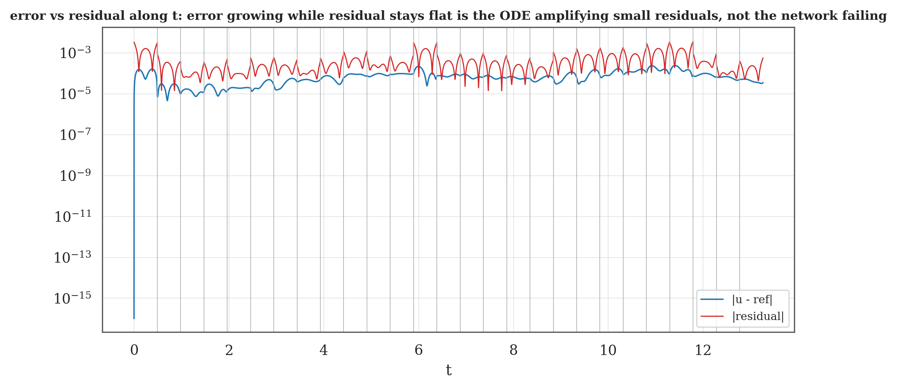
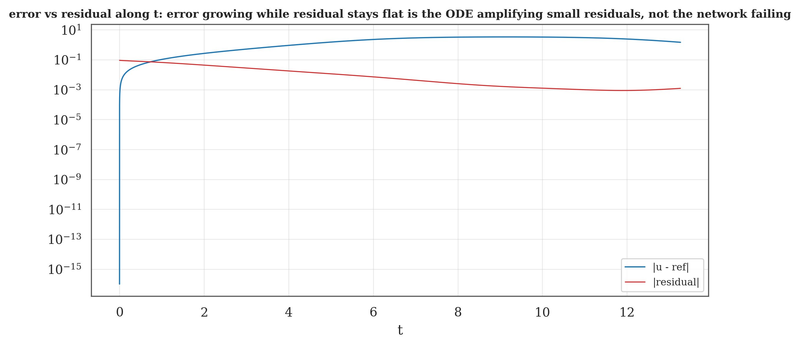

**How to read.** Blue: distance from the reference at every t. Red: size of the ODE residual at the same t
(computed on the evaluation grid, not the training points). Thin vertical lines: window joints. The
residual is what training sees; the error is what we care about; the ODE turns the first into the second.

**Finding.** Run B: residual 1e-4 to 3e-3 with a spike at every joint, error 1e-5 to 2e-4 with no trend. The
residuals do not accumulate into error over one orbit. Run A: the residual is *largest at t = 0* (1e-1) and
smallest at the end (1e-3) while the error does the opposite. The network chose the curve on which the ODE
is easiest to satisfy (near the fixed point f(u) = 0 a constant u has zero residual) and paid for it
with a large residual in the only place the hard IC forces it away from that curve.

### Error growth

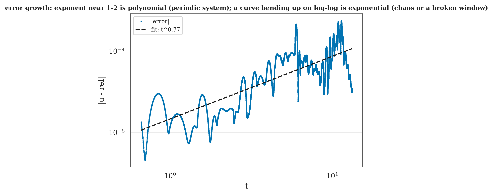

**How to read.** Error against t on log-log axes with a power-law fit. Exponent 1-2 = polynomial growth
(what a periodic system with small residuals should give); a curve bending upward = exponential growth.

**Finding.** Exponent 0.77, sub-linear, and the error *falls* in the last time unit as the orbit closes:
the state returns to where the early, better-trained windows were. No sign of a broken hand-off.

### Joint continuity (Run B)

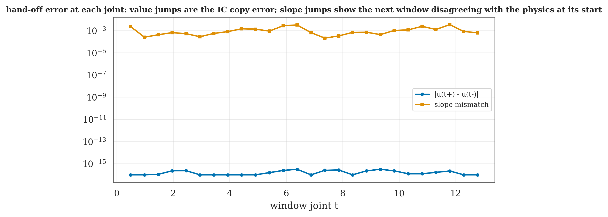

**How to read.** At every window joint: the jump in value between window k and window k+1 evaluated at the
same t (blue), and the mismatch in slope (orange).

**Finding.** Value jumps are 1e-16, machine precision, because the hand-off writes window k's end state
directly into window k+1's trial function. Slope mismatches are about 1e-3: the initial derivative of each window
is N(t0) and has to be *learned* to equal f(u0); it is not enforced. This is the residual spike at
every joint and the first thing to fix if 1e-6 is the goal (a trial function whose derivative at t0 is
f(u0) by construction would remove it).

### Error analysis page

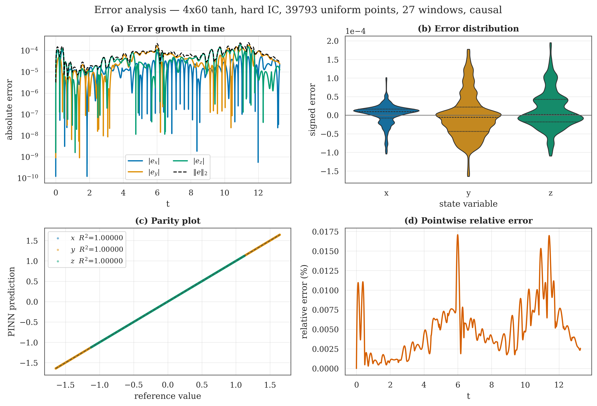

**How to read.** (a) absolute error per component against t; (b) distribution of signed error per component;
(c) prediction against reference (a perfect model is the diagonal); (d) relative error in percent.

**Finding.** Run B: errors are unbiased (violins centred on 0), all three components within 2e-4, R^2 = 1.00000,
relative error below 0.02 %. y has the widest spread because it has the largest amplitude (1.65). Run A's
page shows a parity plot far off the diagonal for x and z.

### Physics residual page

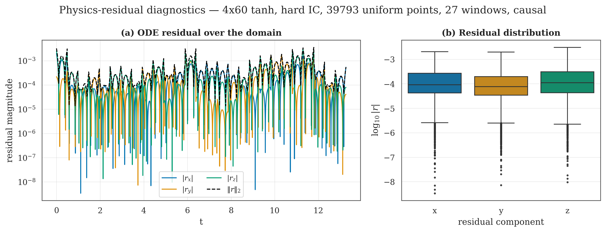

**How to read.** (a) each residual component against t; (b) box plot of log10 |r| per component.

**Finding.** All three components sit at median 1e-4 with the same spread; no component is harder than the
others. The maximum (3e-3) is at the joints.

### Quadratic-invariant drift

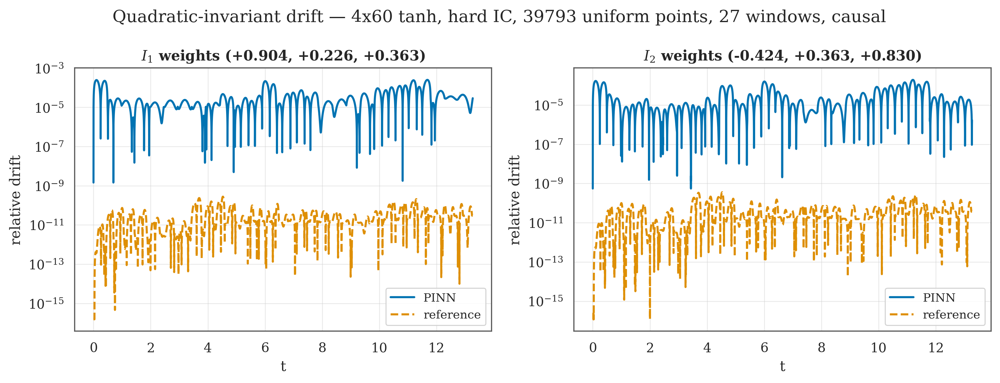

**How to read.** The Lorenz-1960 system conserves two quadratic forms I1, I2 (weights in the panel titles).
The plot is the relative change of each along t for the prediction (blue) and for the reference solver
(orange). A model that drifts off the invariant is not on the orbit even if it looks close.

**Finding.** Run B keeps both invariants to 1e-5 with no trend over the orbit: the errors are on-manifold
wobbles, not a drift away from it. The reference holds them to 1e-11, which sets the floor a better run
could reach.

### Metrics summary, collocation points (`figures/metrics_summary.png`, `figures/collocation_points.png`)

**How to read.** The summary is the error table as a figure (RMSE, max error, R^2 per component). The
collocation figure shows where the training points sit on the t axis and on the orbit.

**Finding.** Run B uses a uniform grid (needed so the causal ordering is well defined); Run A uses Latin
hypercube. The density (3 000 per time unit) is far above what either network can resolve; the residual
figures show no sign of gaps between points.

---

## 7. What the two runs settle, and what they do not

Settled:

- The batch scheme's failure on the full orbit is a wrong minimum, not slow convergence: same loss floor in
  float32 and float64, same floor after three restarts from Adam blow-ups, unchanged by 6 000 L-BFGS
  evaluations, residual concentrated at t = 0.
- Windows + causal weights + hard hand-off remove that failure with the same network: 8.4e-5 RMSE in a quarter
  of the time.
- Error does not accumulate across 27 hand-offs on this orbit; the value hand-off is exact.

Not settled, next knobs:

- 1e-6 was the target; 1e-4 was reached. The residual is dominated by the joints (learned initial slope) and
  by the six fast windows. Options in order of size: more L-BFGS per window (`lbfgs_iters` 3 000), skip the
  eps=10 stage when the plain loss is already below 1e-6 (it hurts there), and a trial function that fixes the
  initial slope.
- The snapshot cadence (every 2 000 global iterations) under-samples the fast windows; the code now snapshots
  at every window end as well, so the next run's staircase and films will show every window.
